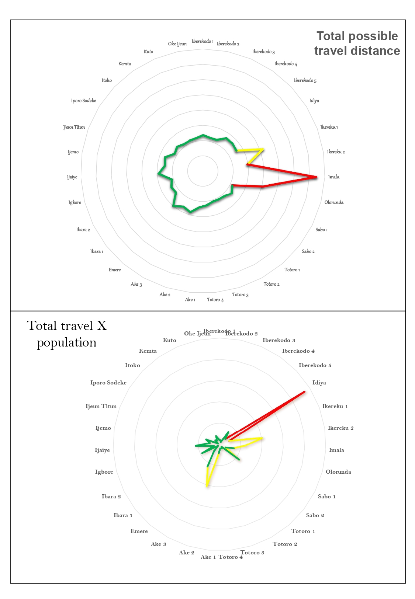

# Emergency Service Accessibility in Abeokuta

## Question

**Which wards in Abeokuta North and Abeokuta South have poorer access to police and fire stations, and how many people live in those areas?**

> The broader goal is to use geospatial analysis to help people understand how easily communities can reach emergency services, identify areas with possible access gaps, and support better planning of emergency service locations.

## Operation

> The project uses spatial data on police stations, fire stations, roads, ward boundaries, and population across the 31 wards in Abeokuta North and Abeokuta South.

Using QGIS and network analysis, I will:

* Map the locations of police and fire stations.
* Calculate road-network distances between ward centres and emergency stations.
* Identify wards with longer distances to emergency facilities.
* Map population distribution across the 31 wards.
* Estimate the population living in wards with limited access to emergency services.

## Expected

> I expect the analysis to reveal differences in emergency service accessibility across the 31 wards. Some wards may be farther from police and fire stations, while others may have larger populations depending on the available facilities.
Combining road-network distances with population data will help show where potential accessibility gaps may affect more people.
---
## Results

#### Population and Emergency Service Accessibility

> To understand how travel distance relates to the number of people living in each ward, I combined the travel-distance results with ward population data.
This provides another way to examine potential emergency service access gaps by considering both how far people may need to travel and the population living in each ward.
---
#### Key Findings

**Idiya** recorded the highest distance–population product at 23,429,994.82.
**Ake 2** followed with 10,264,340.73.
**Ikereku 2** recorded 10,042,461.27.
**Imala** had the highest travel distance at 371.82, with a distance–population product of 6,060,927.28.
**Ibara 1** recorded the lowest distance–population product at 483,207.70.
---
#### What This Means

> The results show that wards with the longest travel distances are not necessarily the same wards with the highest distance–population products. Considering both factors helps provide a broader picture of potential accessibility challenges.

> Idiya stands out because of its high distance–population product, while Imala stands out for its long travel distance. These wards may warrant further investigation when assessing emergency service accessibility.
---
**check out the chart below:**

### Important Note

The distance–population product is a combined indicator, not a direct count of people affected by poor access. A high value does not, by itself, prove that more residents experience delayed emergency response.

The results should be interpreted alongside the original travel distances, population figures, facility locations, and road-network conditions. The distance unit should also be confirmed before making further comparisons.

The results will highlight:

- Wards with the longest road-network distances to emergency stations.
- Differences in access to police and fire services.
- Population living in wards with potential accessibility challenges.
- Areas that may require further attention when planning emergency service coverage.

## Maps Generated

The following maps will be added as the project progresses:

- Distribution of police and fire stations across the study area.
- Road-network accessibility from ward centres to emergency stations.
- Wards ranked by distance to emergency facilities.
- Population distribution across the 31 wards.
- Combined map showing population and potential emergency service access gaps.

## Limitations

- Distance to a ward centre may not represent the actual distance from every household to an emergency station.
- Road-network distance does not account for traffic congestion, road conditions, or emergency response time.
- Population estimates may not reflect the exact number of people currently living in each ward.
- The analysis depends on the completeness and accuracy of the facility and road-network data.
- Distance alone does not determine emergency service quality or availability.

## What I Still Need

- Complete and verified locations of police and fire stations.
- A reliable road network suitable for route analysis.
- Population data for all 31 wards.
- Travel-time or traffic data to improve accessibility estimates.
- Additional information on emergency facility capacity and service coverage, where available.

## Project Reflection

This project explores how GIS can help answer a practical question: **How easily can people reach emergency services in Abeokuta?**

By combining emergency station locations, road networks, and population data, I aim to move beyond simply mapping facilities to understanding which communities may face greater difficulty accessing them.

The goal is to turn geospatial data into useful information that can support emergency service planning and better-informed decisions.
